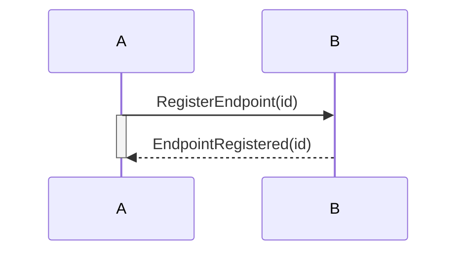
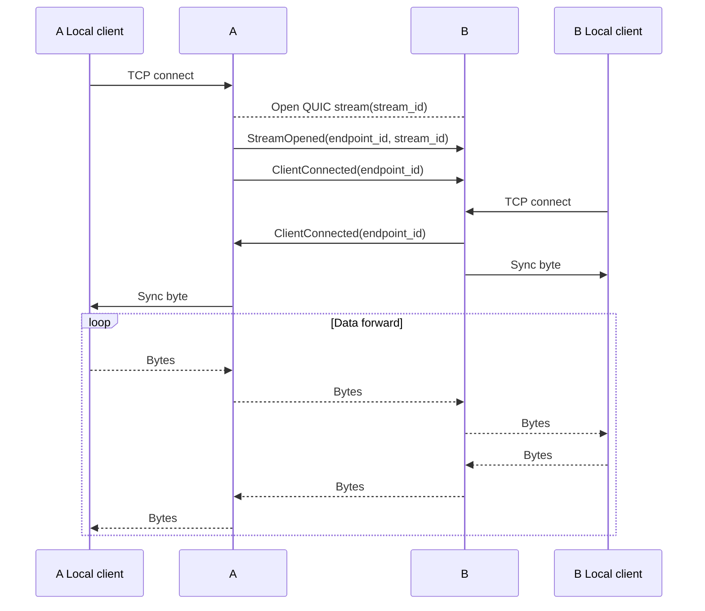

# Muxer over QUIC for Kyber

## Description

kymux is a library that provides a QUIC proxy for Kyber components. Components must use Kymux to communicate over the network, within a single QUIC connection.

Here is an overview of the components interaction:
```
   +----------+                                                      +-----+
   | AvServer |<----.                                         .----> | VLC |
   +----------+     | IPC                                     |      +-----+
                    |                                         |
   +----------+     '--> +-------+                +-------+ <-'      +-----+
   | AvServer |<-------> | KYMUX |<==============>| KYMUX | <------> | VLC |
   +----------+     .--> +-------+      QUIC      +-------+ <-.      +-----+
                    |                                         |
  +-------------+   | IPC                                     |   +-------------+
  | InputServer |<--'                                         '-> | InputServer |
  +-------------+                                                 +-------------+
```

## Definitions

Multiples parts are involved:
* `Kymux`: Manage the Quic connection, and provide an higher level API on top of it. Open the required streams and make `Local Kymux client` <-> `Quic stream` transport. Once Quic connection has been established, each side of the connection has a `Kymux` instance, and can register one or more `Endpoint`.
* `Endpoint`: A logical Kymux stream that is produced and/or consumed by a Kyber component, like AvServer or InputServer. Each component must open an IPC connection to `Kymux` to interact with the `Endpoint`.
* `Kymux URI`: Components get a `kymux://` URI that describes how to connect to `Kymux`, and the `Endpoint` that will be linked with the IPC stream.
* `Local Kymux client`: A component that is connected to `Kymux`, using a `Kymux URI`.
* `ControlChan`: The first Quic stream opened automatically during connection workflow. In charge of authentication, `Endpoint` registration.

## Repository content

* [kymux](kymux): The `kymux` library that handle the Quic connection and the interaction with `Local Kymux client`.
* [kymux/examples](kymux/examples): A complete example that uses [kymux](kymux) to create a Quic connection, create endpoint and uses [kymux_client](kymux_client) to produce and consume data.
* [kynet](kynet): A network transport API for QUIC and WebTranrpot
* [kyproto](kyproto): A media transport API to transmit video, audio and input
  packets
* [kycom](kycom): An IPC component to expose kyproto endpoints over a local IPC
  (TCP) connection

```
        Desktop      Browser
       (non-WASM)    (WASM)
           ||          ||
           \/          ||
        +-------+      ||
   IPC  | kycom |      ||
        +-------+      ||
            |          ||
            v          \/
          +---------------+
          |    kyproto    |  media transport API
          +---------------+
                  |
                  v
          +---------------+
          |     kynet     |  network transport API
          +---------------+
```

## Connection workflow

### Quic connection

Roles
* Listener: The side that listen for incoming connections
* Initiatior: The side that connects to the listener

Steps
1. The listener waits for Quic incoming connection
2. The initiatior connects to the listener. At this point, no Quic stream is opened.
3. The initiator opens a bidirectional Quic stream (the `ControlChan`) and sends an `Authenticate` packet on it. The `Authenticate` packet allows the listener to detect the `ControlChan` opening, and to accept or reject the connection.

After step 3, the Quic connection is established, with a working `ControlChan`, and the initiator has been authenticated by the listener.

### Endpoint registration

Each side of the Kymux connection can register its own `Endpoint`. It is done by sending a `RegisterEndpoint` on the `ControlChan`. The registration is synchronous: the peer must reply with a `EndpointRegistered` packet to notify that the registration is complete.

The `Endpoint` id is a `u64` that is randomly generated by the peer that registers the `Endpoint`.



At this point, no Quic stream has been created, but `Kymux URI` can be crafted and sent to other components to interact with the `Endpoint`.

### `Local Kymux client` connection

Now that a component gets a `Kymux URI`, it can connect to `Kymux`. The IPC connections triggers the QUIC stream opening. Once both sides of the `Endpoint` gets a `Local Kymux client` connected, the global forward process is started.

Steps
1. `A` side: `Local Kymux client` connects to the `Endpoint` using a `Kymux URI`. Because `Kymux` listen on a single TCP socket, the `Endpoint` must be sent after the local TCP connection has been established. At this point, `Kymux` can do the `Local Kymux client` <-> `Endpoint` mapping. `Local Kymux client` waits to receive a single byte that will mean that the connection with `B`'s `Local Kymux client` has been established.
2. `A` side: `Kymux` opens a Quic stream and sends a `StreamOpened(endpoint_id, stream_id)` on the `ControlChan`. The message allows `B` to map correctly the new Quic stream to the correct `Endpoint`.
3. `A` side: `Kymux` sends a `ClientConnected(endpoint_id)` to notify that its `Local Kymux client` is connected.
4. `B` side: `Kymux` receives `StreamOpened(endpoint_id, stream_id)` on the `ControlChan` and detected that Quic stream `stream_id` has been opened.
5. `B` side: `Local Kymux client` connects to the `Endpoint` using a `Kymux URI`
6. `B` side: `Kymux` sends a `ClientConnected(endpoint_id)` to notify that its `Local Kymux client` is connected.
7. `B` side: `Kymux` sends a single byte to the `Local Kymux client` to notify that the connection has been established. The forwarding tasks are started at this point.
8. `A` side: `Kymux` sends a single byte to the `Local Kymux client` to notify that the connection has been established. The forwarding tasks are started at this point.


